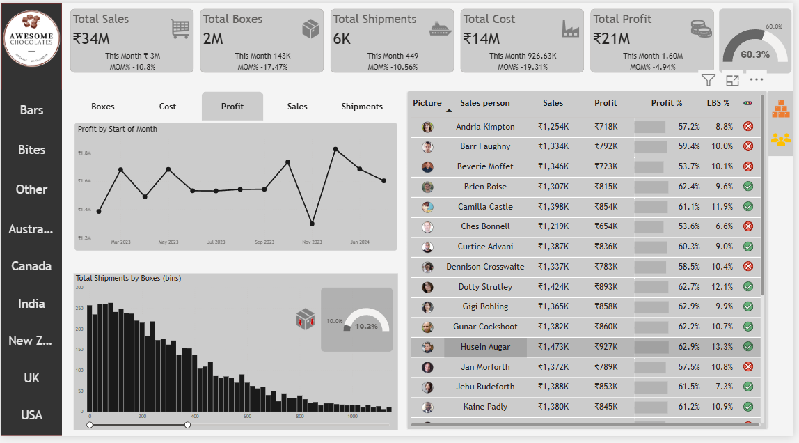

# 🍫 Chocolate Sales Analysis

An interactive **Power BI project** that provides insights into **chocolate sales performance**, focusing on key business metrics like **shipments, profit percentage, and category-wise performance**.  
This dashboard uses multiple **DAX measures** and interactive visuals to help businesses understand sales trends and profitability.

---

## 📊 Features

- 📦 **Low Box Shipments Analysis:** Identifies shipments with fewer boxes and tracks efficiency.  
- 💰 **Profit Percentage Metrics:** Calculates profit margins and highlights high-performing regions.  
- 📈 **Dynamic Tables & Charts:** Displays sales, profit, and shipment details across multiple dimensions.  
- 🎚️ **Interactive Slicers & Filters:** Allows users to explore data by region, date, and shipment type.  
- 🧮 **Advanced DAX Measures:** Custom metrics like Profit %, Revenue Growth, and Shipment Count.  

---

## 🧾 Files

- **Chocolate_Sales_Analysis.pbix** – Power BI dashboard file  
- **Assets/Chocolate_sale_analysis.png** – Dashboard preview image  
- **Dataset/** – Contains the dataset used for analysis  

---

## 🚀 How to Use

1. Open `Chocolate_Sales_Analysis.pbix` in **Power BI Desktop**.  
2. Interact with filters, slicers, and visuals to explore insights.  
3. Analyze profit trends, shipment efficiency, and sales KPIs dynamically.  

---

## 📸 Preview

---

## 🧠 Technologies

- **Power BI Desktop** – for visualization and reporting  
- **DAX (Data Analysis Expressions)** – for calculated KPIs and performance metrics  

---

## 📜 License

This project is open for **educational and analytical purposes**.

---

⭐ *If you found this project useful, please star the repository to support more Power BI builds!*
